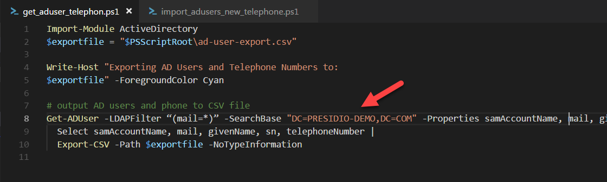

# AD telephone number updates via PowerShell

The following information provided is in reference to the following two
PowerShell scripts.

1.  get_aduser_telephone.ps1

2.  import_adusers_new_telephone.ps1

## Problem Statement:

It is desired to use the Active Directory (AD) user telephone number field for
the new Cisco Collaboration Solution to be deployed. In the current state,
telephone numbers may be missing, formatted incorrectly, or truncated as
extensions. For the best experience to the end users, the final state should be
normalized numbers, globally unique, and dialable from any device. By
definition, the industry standard in telecommunication directory formatting is
to provide the telephone number in a +E164 format. For example the following two
numbers would be normalized as shown below:

-   **UK Number – (44) 207 5555-1234 +4420755551234**

-   **US Number – (1) 781-555-1234 +17815551234**

Changing AD telephone numbers programmatically is a multi-step process. Using
the scripts referenced in this document it can be done quickly and efficiently
by following the steps as defined below.

## Solution:

### Export the users

1.  To do this, there are few small pre-requisites. The AD search space must be
    updated in the script to be restricted to where the users exist.

    

2.  Optional: The script is currently filtering on the mail attribute being
    populated. This can alternatively be modified to any other attribute
    (“memberOf” for example to filter on AD groups.)

3.  Run the “*get_aduser_telephone.ps1*” script from a machine on the network
    which has Powershell installed. Once the script has been run, a new file
    will be created in the directory that the script was run from. The file name
    will be called “ad-user-export.csv”.

### Modify the numbers

1.  Make a copy of the exported file and rename it to ad-user-import.csv

2.  Remove any rows which contain users which you would not want to be modified.

3.  Using Excel, notepad, or any preferred text editor

    1.  Modify the telephone number column to be the +E164 formatted numbers.

    2.  *note: Excel has the added benefit of using formulas to convert number,
        and using advanced find and replace capabilities*

4.  Review the import file for errors, and make sure it is scoped to only
    contain the users you would like to modify. Once you are happy, move on to
    the Import step.

### Import the updated user telephone numbers

1.  Run the “*import_adusers_new_telephone.ps1*” script

2.  Review the live output from the script to validate that the numbers are
    indeed updating.

3.  Verify in Active Directory Users and Computers.
